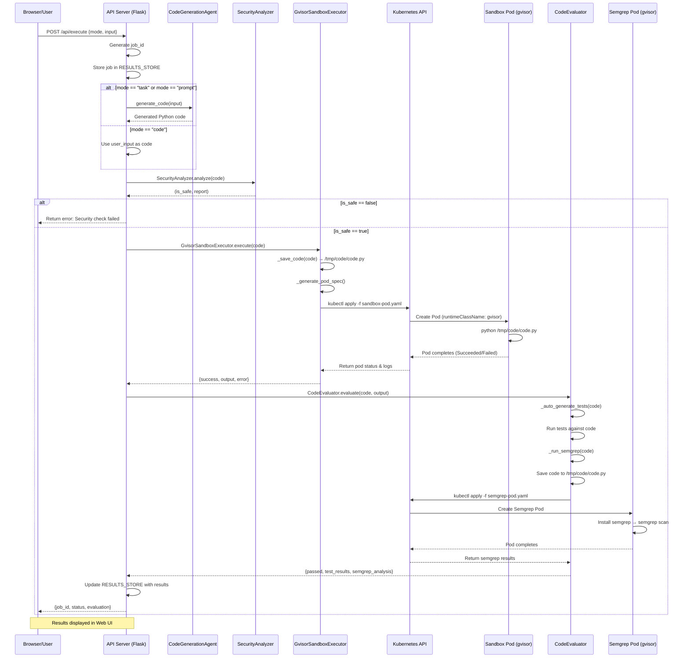

# Sequence Diagram - Gvisor Code Execution Platform

## Detailed Flow Description

### 1. Request Submission
- User submits code via web interface at `/api/execute`
- Supports 3 modes: `code` (direct), `task` (LLM task), `prompt` (LLM prompt)

### 2. Code Generation (if needed)
- For `task`/`prompt` modes: `CodeGenerationAgent` generates Python code
- For `code` mode: Uses user-provided code directly

### 3. Security Analysis
- `SecurityAnalyzer.analyze(code)` checks for dangerous patterns
- Blocked patterns: subprocess, os.system, eval, exec, socket, file operations, etc.
- If unsafe: Returns error immediately

### 4. Sandbox Execution
- Code saved to `/tmp/code/code.py` on shared PVC
- Creates Kubernetes pod with `runtimeClassName: gvisor`
- Pod executes: `python /tmp/code/code.py`
- Returns execution output

### 5. Code Evaluation
- Auto-generates test cases based on function names
- Runs tests against the code
- Creates separate Semgrep analyzer pod
- Semgrep scans for security vulnerabilities

### 6. Results Return
- All results stored in `RESULTS_STORE`
- Response includes: job_id, status, test results, semgrep findings
